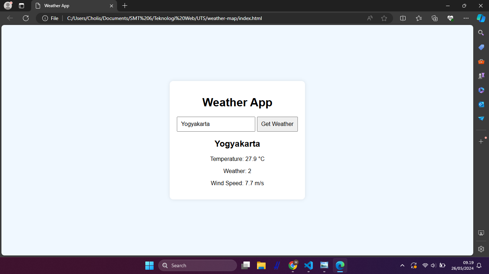

# Weather Map

Ini adalah sebuah website cuaca sederhana yang memungkinkan pengguna untuk memasukkan nama kota dan mendapatkan informasi cuaca terkini untuk kota tersebut. Website ini menggunakan API dari Open-Meteo.


## Run Locally

Clone the project

```bash
  git clone https://github.com/CholisMajid/weather-map.git
```

Go to the project directory

```bash
  cd weather-app
```

Open the index.html file in your browser:

```bash
  open index.html  # macOS
  xdg-open index.html  # Linux
```


## Screenshots



